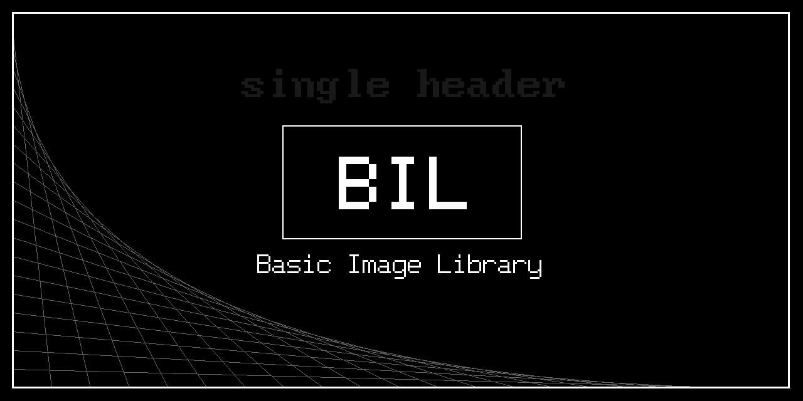
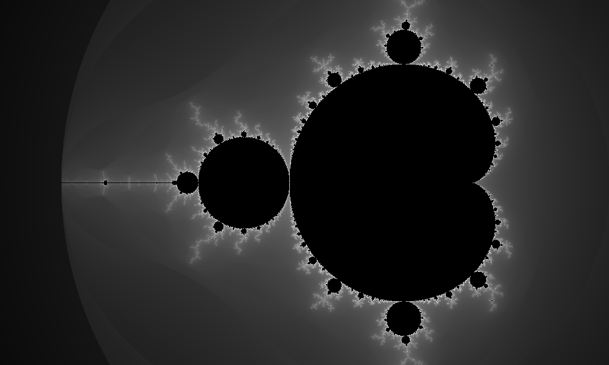
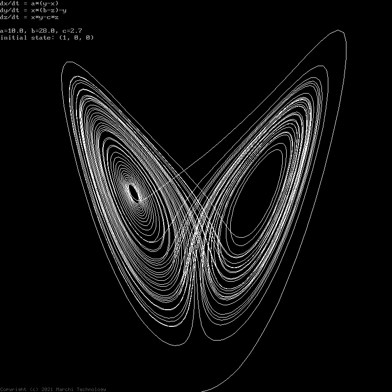
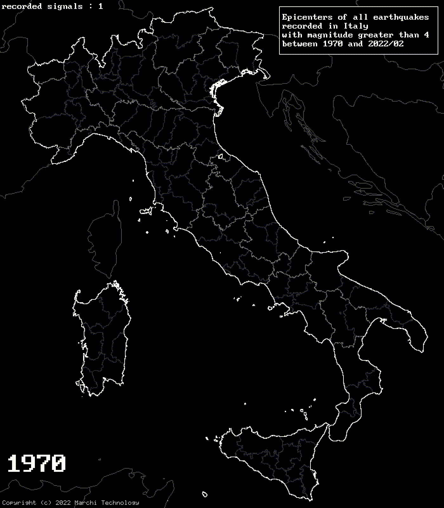

# BIL (*Basic Image Library*)

C++ library for images

This is a simple library mainly designed for image creation, but it can also read simple images format. With this tool you can create an image using several drawing functions:
 - set pixel color (with many palettes)
 - simple geometries (like lines, circles, bezier curves and more)
 - text in bitmap fonts

There are also some utility functions for upscaling, blurring and more.
The author is very busy with academic obligation so updates in this projct are not so often...

## Design objectives
 - All classes and functions in header files (no precompiled library or external dependencies)
 - Easy to use and the code can be understanded easly
 - Works on Windows, Linux and Android (C++11 standard)
 - Unlicensed (anyone can use and modify it as wanted)

## Usage
To use the class include the "`Image.hpp`" header file (inside the `include` folder, other header files in this folder are necessary):
```c++
#include "Image.hpp"          // include the Image class

int main()
{
   Image img(800,600);        // create an 800x600 pixels image
   img.clear(255,255,255);    // set all pixels to white
   img.line(0,0,800,600);     // draw a diagonal line on the image
   
   img.save_png("image.png"); // save image as 24-bit PNG file
}
```
It can be used also the single header-file `Image.h` which includes all the separated nested header files. This file is generated through the automated software [`header-merger`](https://github.com/mrc-tech/header-merger) developed by me.

For other, more complex, examples please see `examples` folder.

## Examples








## ToDo
For the moment this *todo list* is written in italian. As far as the first contributor comes I'll translate in English...

- Metodi per generare le figure geometriche fondamentali in `image` (mancano l'arco di cerchio, le splines [Per le splines usare il metodo di Cutmann, vedere come ho fatto in DOS] etc.)
- inserire un metodo per il `flood-fill` delle figure (studiare bene come fare)
- Fare in modo che si possano anche _leggere_ i file PNG e JPG (almeno nella loro più semplice accezione)
- fare in modo di poter scalare (anche di 2 e 0.5 soltanto) e di ruotare l'immagine (anche solo di +-90 gradi)
- Fare una routine di *Anti Aliasing* sull'immagine
- Mettere la funzione che disegna uno "squircle" (vedere il video su youtube). che gli dai _r_ e _n_ (capire come disegnare dalla formula). O anche solamente fare un esempio...
- nell'introduzione di questo readme mettere un link di riferimento anche al futuro repo `HPlotter` che usa BIL per stampare i grafici in _png_
